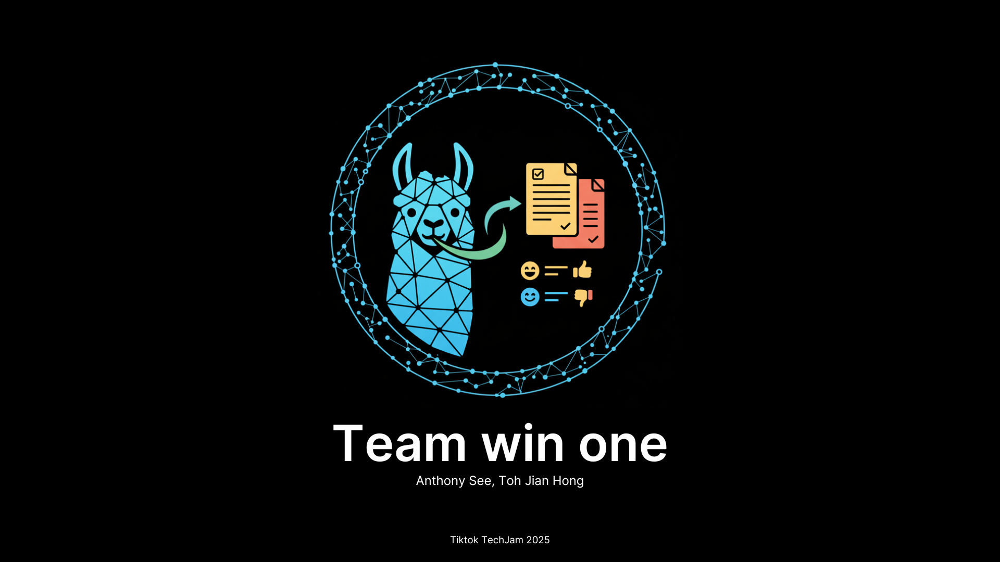

# Project Title : Leveraging LLM in Assessing Reviews with RAG

This project presents a novel approach to assessing and classifying user reviews. It automatically identifies reviews that violate platform policies (advertisements, irrelevant content, or rants without visit) while also detecting valid reviews. Our system combines Retrieval-Augmented Generation (RAG) with an ensemble of three Large Language Models (LLMs) for high accuracy, explainability, and scalability.

### Project Video 
https://youtu.be/6cyCtZDzers 

### Introduction 

Online reviews influence decisions for users, businesses, and platforms. However, noisy or irrelevant reviews—such as spam, unrelated chatter, or unverified rants—can distort reality, leading to poor decisions, unfair reputations, and high moderation costs.

Traditional ML classifiers require large, clean, labeled datasets, which are difficult to obtain. To overcome this, we designed a system that requires minimal labeled data while maintaining high classification accuracy and explainability. This also means we do not need to retrain the model every time categories are updated.

Objective:

- Automatically classify reviews into four categories aligned with platform policies.

- Provide rationales for every classification for moderator confidence.

- Achieve high accuracy with fast inference and minimal human intervention.

### Approach 
The project was structured into four main components:

#### Pre-Filtering : 
- Obvious advertisements or irrelevant reveiws. 
- Saves time and compute by skipping unnecessary LLM calls

####  RAG-Based Backend
- A vector store contains policies and example reviews.
- When a review is submitted, the system retrieves the most relevant context to guide the LLMs.
- Optional metadata (e.g., business type) further informs classification, improving accuracy and context-awareness.
  
#### Ensemble Approach:
- The three models process reviews in parallel.
- Outputs are combined via bootstrapping and majority voting for robust and reliable classification.
- Each model brings unique strengths, and ensemble voting reduces errors compared to using a single model.
- (Models used : Llama2:7b, Deepseel r1-7b, gemma3:4b) 

#### Front-End Integration via API: 
Results and rationales are served through a Lynx-powered web interface

Features:
- Single review classification (with optional metadata)
- Batch upload via CSV for large-scale processing
- Dashboard visualization for immediate insights
- Exportable results for integration into existing workflows

### Testing & Evaluation 
#### Key Metrics:
- Accuracy: Up to 78% Overall
- Precision & Recall: Strong performance for Advertisement and Valid categories
- Inference Speed: Average 4s per review; 3.2s with metadata

#### Observations:
- Ambiguous reviews cause some misclassification between “Rant Without Visit” and “Irrelevant Content.”
- Metadata improves accuracy by 8% and inference speed by 15%.

We evaluated the system on a curated dataset of 361 samples (≈80 samples per category). This limited sample size is not used to train our models in the traditional sense, as our approach is based on Retrieval-Augmented Generation (RAG) and few-shot prompting. Instead, this dataset serves two key purposes:

* Demonstration of Efficacy: The small dataset allows us to run rapid, repeatable tests to demonstrate that our RAG-based ensemble system can accurately classify reviews based on a limited set of examples.

* Benchmark for Local Testing: It provides a practical, manageable benchmark for continuous integration and local development, allowing us to quickly verify that changes to the system do not degrade performance.

By using this small, high-quality dataset purely for evaluation, we can validate our innovative approach without the need for a massive, pre-labeled training corpus, proving that our methodology can perform well with minimal data.


### Limitations and Future Works: 
- Tie-Breaking: Ensemble currently defaults to LLaMA2-7B when all models disagree; weighted voting could improve this.

- Language Support: Only English is currently supported; mixed-language reviews remain challenging.

### Future Works 
- Refine Ensemble method for better category-specific performance
- Expand to multi-language support
- Exploration of different forms of Retreival Augmented Generation. Such as DeepRAG for higher answer accuracy.


# Set Up Guide
Follow the instructions below to start up the app.

### Prerequisites
Python: Ensure you have Python installed. The project was developed with Python 3.1.2
Ollama: You need to have Ollama installed and running on your system to manage the language models.

### Installation
Clone the Repository

```bash
git clone git@github.com:jiannhonggg/TechJam2025.git
cd your-project-name
``` 

Set up virtual Environment
```bash
python3 -m venv venv
source venv/bin/activate  # On Windows, use `venv\Scripts\activate`
``` 

Install dependencies 
```bash
pip install -r requirements.txt
``` 

Set Up Ollama Models
Download Ollama from https://ollama.com/download/windows 
```bash
ollama pull llama2:7b
ollama pull deepseek-r17b
ollama pull gemma:4b
``` 

Usage : To run the application, execute the app.py script 
```bash
python app.py
``` 
### Installation for LynxWebapp
See: [Details](LynxWeb/README.md)

# How to reproduce results : 
Assuming that you have followed the set up guide correctly. 
Run the application to play with the single classifcation and batch classifcation and view rationale. 
OR 
Run the command below on the command line. if testing for performance metrics on how it fare against our curated dataset. 
```bash
python -m src_TestSet.evaluate
``` 